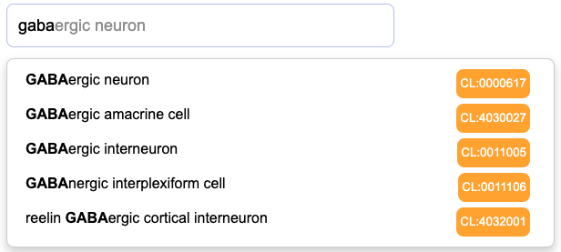

# Ontology Search Widget

The Ontology Search Widget provides an easy-to-integrate search interface for ontologies, compatible with the OBASK [Ontology Search Endpoint](https://github.com/OBASKTools/ontology-search). Utilizing HTML, CSS, jQuery, and typeahead.js, this widget offers a highly configurable and customizable experience for embedding ontology search functionalities into web applications.

<p align="center">
    
</p>

## Features

- **Auto-Completion**: Suggests possible ontology terms as you type, enhancing user experience.
- **Customizable Options**: Easily configure default settings or provide dynamic updates to suit your needs.
- **Compatibility**: Works seamlessly with any web application using basic web technologies.

## Getting Started

### Prerequisites

Ensure you have jQuery and typeahead.js included in your project to use the Ontology Search Widget.

### Installation

To integrate the Ontology Search Widget into your webpage, follow these steps:

1. Include the widget's JavaScript and CSS files in your project.
2. Use the following script to convert an `input` element into an ontology search box:

    ```javascript
    $("#txtbox1").ontology_search();
    ```

### Usage

Here is a simple example to get you started:

```html
<!-- Index.html -->
<html>
<head>
    <link rel="stylesheet" href="css/styles.css" />
    <!-- Include dependencies -->
    <script src="https://code.jquery.com/jquery-3.7.1.min.js"></script>
    <script src="https://code.jquery.com/ui/1.14.0/jquery-ui.js"></script>
    <script src="https://cdnjs.cloudflare.com/ajax/libs/typeahead.js/0.11.1/typeahead.bundle.min.js"></script>
    <script src="js/ontology_search.js"></script>
</head>
<body>
    <input id="txtbox1" type="text" placeholder="Search">
    <script>
        // Initialize the search widget
        $("#txtbox1").ontology_search();
    </script>
</body>
</html>
```

Check [index.html](index.html) for a a more extensive example, built around support for the ontology fields in the [CellXGene metadata schema](https://github.com/chanzuckerberg/single-cell-curation/blob/main/schema/5.1.0/schema.md#obs-cell-metadata).  For e

### Configuration

By default, the widget uses the following configuration:

```javascript
options: {
    endpoint: "https://cellular-semantics.sanger.ac.uk/demo",
    filter: [],
    boost: [],
}
```

#### Custom Configuration

Pass custom configurations while calling the widget factory method:

```javascript
$("#txtbox1").ontology_search({
    endpoint: "http://localhost:8007/ontology",
    boost: ["Cell", "Homo_sapiens"],
});
```

#### Dynamic Configuration Update

Update configurations dynamically at runtime:

```javascript
$("#txtbox1").ontology_search("updateOptions", {filter: ["Cell"]});
```

## Development Environment

Set up your development environment following the steps provided in the [development documentation](development.md).

## License

This project is licensed under the Apache-2.0 - see the [LICENSE.md](LICENSE.md) file for details.

## Support

For support, please open an issue in the repository or contact the project maintainers.
